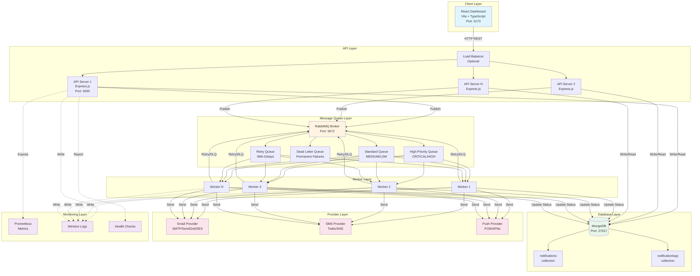
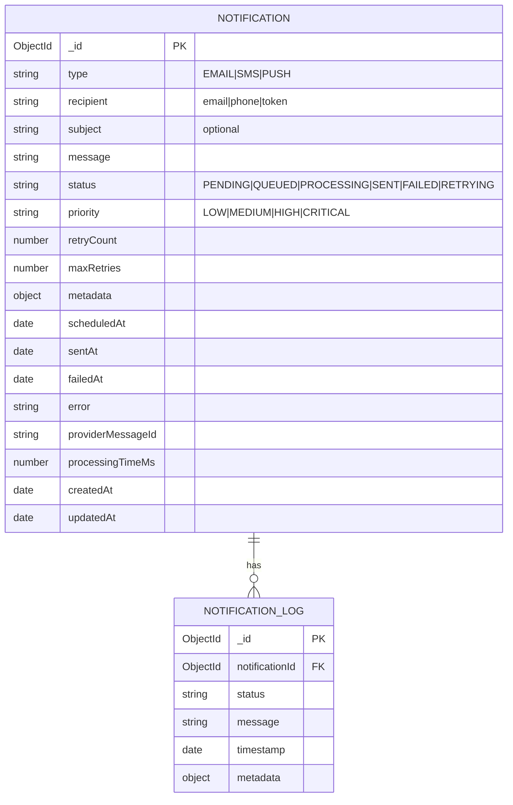
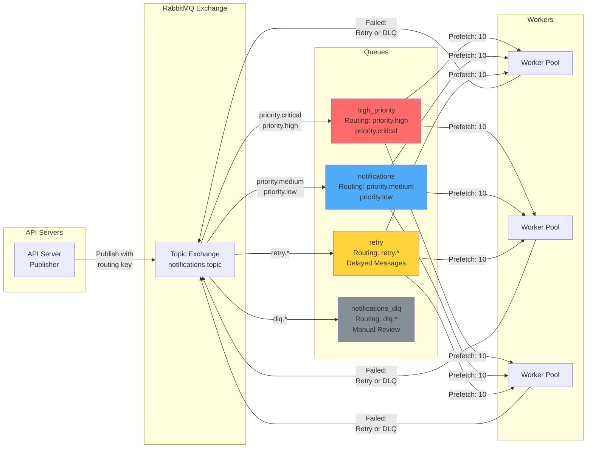
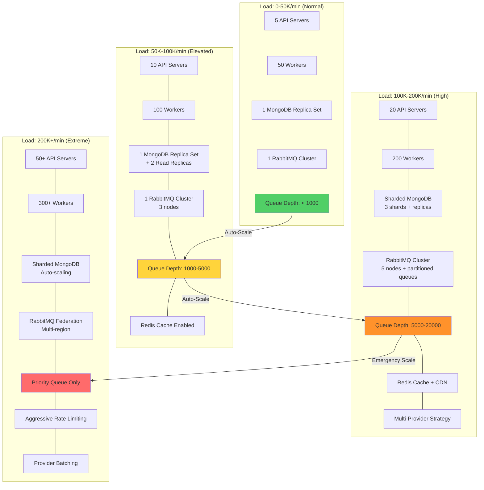
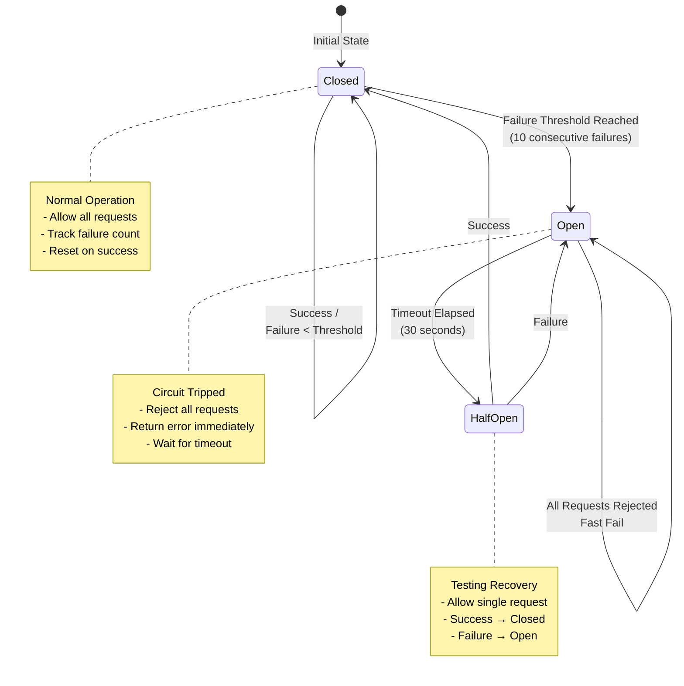
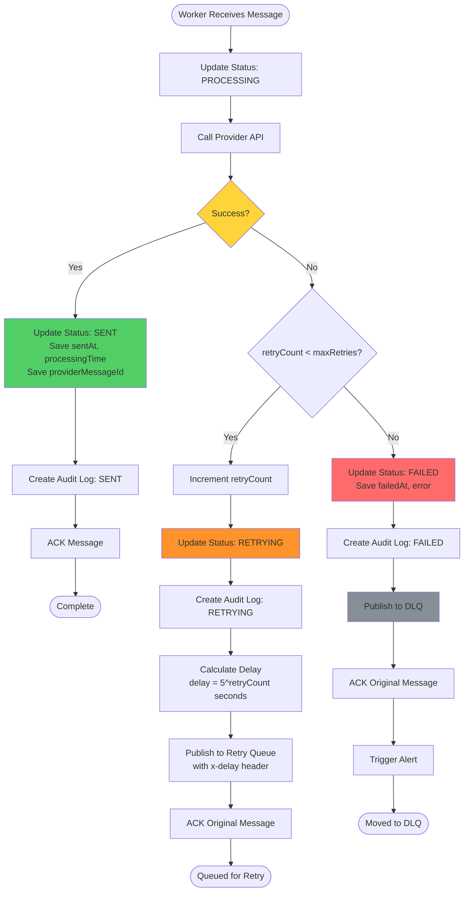
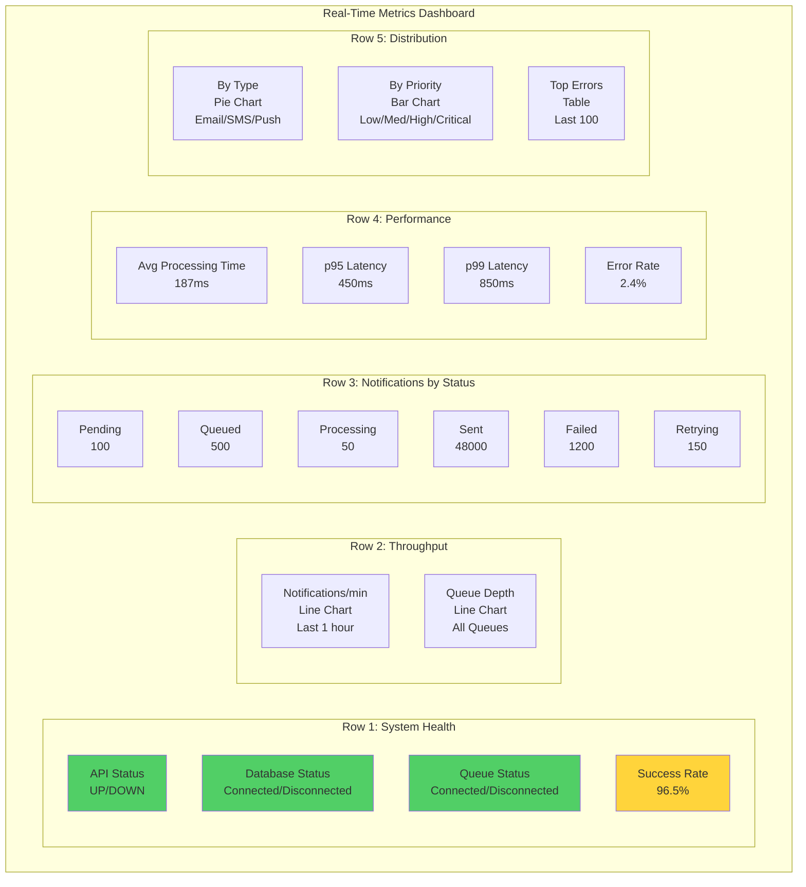
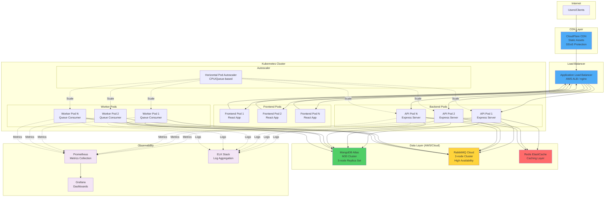

# WaveCom Notification System - Architecture Diagrams

## System Architecture Overview



## Notification Lifecycle Flow

```mermaid
sequenceDiagram
    participant Client
    participant API as API Server
    participant DB as MongoDB
    participant Queue as RabbitMQ
    participant Worker
    participant Provider as Email/SMS/Push Provider

    Client->>API: POST /api/notifications
    activate API

    API->>API: Validate Request (Joi)

    API->>DB: Create Notification Document
    activate DB
    DB-->>API: Document ID + Status: PENDING
    deactivate DB

    API->>DB: Create Audit Log (PENDING)

    API->>Queue: Publish Message to Queue
    activate Queue
    Note over Queue: Route by Priority:<br/>HIGH/CRITICAL → high_priority<br/>MEDIUM/LOW → notifications
    Queue-->>API: Message Queued
    deactivate Queue

    API->>DB: Update Status: QUEUED
    API->>DB: Create Audit Log (QUEUED)

    API-->>Client: 201 Created {id, status: QUEUED}
    deactivate API

    Queue->>Worker: Consume Message
    activate Worker

    Worker->>DB: Update Status: PROCESSING
    Worker->>DB: Create Audit Log (PROCESSING)

    Worker->>Provider: Send Notification
    activate Provider

    alt Success
        Provider-->>Worker: 200 OK {messageId}
        deactivate Provider

        Worker->>DB: Update Status: SENT<br/>sentAt, processingTimeMs, providerMessageId
        Worker->>DB: Create Audit Log (SENT)
        Worker->>Queue: ACK (remove from queue)

    else Provider Failure
        Provider-->>Worker: 5xx Error / Timeout
        deactivate Provider

        alt Retry Count < Max Retries
            Worker->>DB: Update Status: RETRYING<br/>Increment retryCount
            Worker->>DB: Create Audit Log (RETRYING)
            Worker->>Queue: Publish to Retry Queue (with delay)
            Worker->>Queue: ACK (remove from original queue)

            Note over Queue: Exponential Backoff:<br/>Attempt 2: 5s<br/>Attempt 3: 25s<br/>Attempt 4: 125s

            Queue->>Worker: Consume from Retry Queue (after delay)
            Worker->>Provider: Retry Send

        else Retry Count >= Max Retries
            Worker->>DB: Update Status: FAILED<br/>failedAt, error
            Worker->>DB: Create Audit Log (FAILED)
            Worker->>Queue: Publish to Dead Letter Queue
            Worker->>Queue: ACK (remove from queue)
        end
    end

    deactivate Worker

    Client->>API: GET /api/notifications/{id}
    activate API
    API->>DB: Query Notification + Logs
    activate DB
    DB-->>API: Notification + Audit Trail
    deactivate DB
    API-->>Client: 200 OK {notification, logs}
    deactivate API
```

## Data Model Diagram



## Queue Architecture



## Scaling Strategy Diagram



## Circuit Breaker State Machine



## Retry Logic Flow



## Monitoring Dashboard Layout



## Deployment Architecture (Production)



## Cost Optimization Strategy

```mermaid
graph LR
    subgraph "Development"
        D1[Local Docker<br/>MongoDB + RabbitMQ<br/>Cost: $0]
        D2[1 API Server<br/>1 Worker<br/>Cost: $0]
        D3[Total: $0/month]

        D1 --- D2
        D2 --- D3
    end

    subgraph "Staging"
        S1[MongoDB Atlas M10<br/>Shared Cluster<br/>Cost: $57]
        S2[CloudAMQP Rabbit<br/>Lemur Plan<br/>Cost: $0]
        S3[2 API Servers<br/>t3.small<br/>Cost: $30]
        S4[2 Workers<br/>t3.small<br/>Cost: $30]
        S5[Total: $117/month]

        S1 --- S2
        S2 --- S3
        S3 --- S4
        S4 --- S5
    end

    subgraph "Production (50K/min)"
        P1[MongoDB Atlas M30<br/>3-node Replica<br/>Cost: $390]
        P2[CloudAMQP Rabbit<br/>Tiger Plan<br/>Cost: $119]
        P3[10 API Servers<br/>t3.medium<br/>Cost: $370]
        P4[50 Workers<br/>t3.small<br/>Cost: $750]
        P5[Redis ElastiCache<br/>cache.t3.micro<br/>Cost: $12]
        P6[Load Balancer<br/>Application LB<br/>Cost: $23]
        P7[Total: $1,664/month]

        P1 --- P2
        P2 --- P3
        P3 --- P4
        P4 --- P5
        P5 --- P6
        P6 --- P7
    end

    style D3 fill:#51cf66
    style S5 fill:#ffd43b
    style P7 fill:#ff922b
```



---

## Additional Resources

- **Main Documentation:** [README.md](README.md)
- **Frontend Setup:** [frontend/FRONTEND_SETUP.md](frontend/FRONTEND_SETUP.md)
- **API Documentation:** See README.md API section
- **Deployment Guide:** See README.md Getting Started section

---

**Architecture designed for scale, reliability, and observability**
