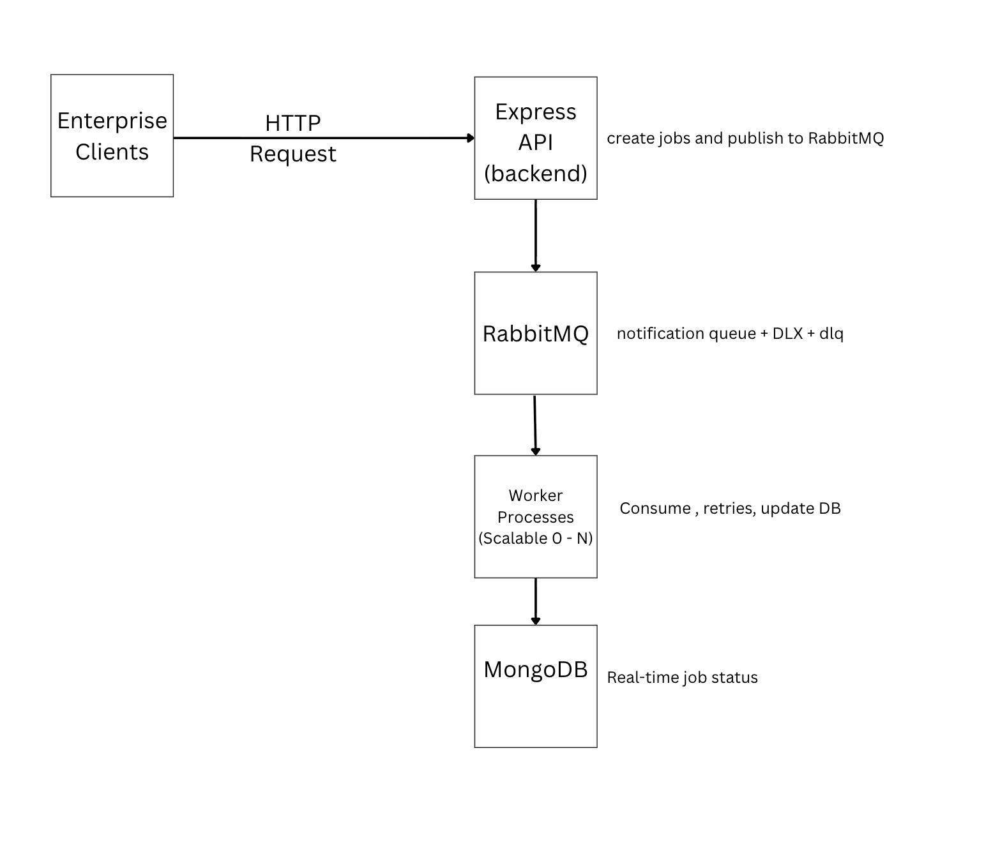

# WaveCom Notification Delivery System

Scalable • Fault-Tolerant • Enterprise-Ready Transactional Notification Service

## Overview

WaveCom is a fault-tolerant notification delivery platform built for banks, fintechs, and logistics companies that cannot afford to lose a single critical message (transaction alerts, OTPs, delivery updates, fraud alerts, etc.).

## Problem Overview

Enterprise clients (banks, fintechs, logistics companies) need to deliver **critical transactional notifications** (OTPs, transaction alerts, fraud warnings, delivery updates) with **100% reliability** and **zero message loss**, even under extreme load spikes (e.g., 50,000 notifications/minute during salary day or market flash crash).

The system must:

- Never lose a message
- Automatically retry failed deliveries
- Provide real-time visibility into delivery status
- Scale horizontally under load
- Gracefully handle provider outages

## Architecture Diagram



## Setup & Running

### Prerequisites

- Docker & Docker Compose
- Node.js 20+ (only if running locally without Docker)

1. Clone & Enter Directory

```Bash
git clone https://github.com/NueloSE/wavecom-backend.git
cd wavecom-backend
```

2. Start Everything (Recommended)

```Bash
docker-compose up --build
```

This starts:

- MongoDB
- RabbitMQ (management UI: http://localhost:15672 | guest/guest)
- Express API → http://localhost:5001
- 1 Worker instance

3. Alternative Modes

```bash

docker-compose up backend  # Start only API(jobs stay pending)
docker-compose up worker # Start only workers(processes pending jobs)
```

4. Test Enterprise Traffic

```bash
./test-integration.sh
```

Output:

```bash
1. Salary Credit Alert (SMS)      → QUEUED
2. Card Transaction Alert         → QUEUED
3. Login OTP (Email)              → QUEUED
4. Delivery Update (Push)         → QUEUED
5. Fraud Alert (SMS)              → QUEUED
```

All 5 notifications are queued → workers process → status updates instantly.

5. Observe Everything

`http://localhost:5001` API root – “WaveCom … Running”
`http://localhost:5001/api/notifications` All jobs with real-time status
`http://localhost:15672` RabbitMQ UI – see queues, DLQ, message rates

6. Queueing + Retry Flow

```bash

New Job
   ↓
Create in MongoDB (status: pending)
   ↓
Publish to RabbitMQ "notifications" queue
   ↓
Worker consumes → status: processing
   ↓
Call mock provider
   ↓
Success → status: sent → ACK message
   ↓
Failure → attempts++
   ↓
attempts < 5 → requeue with delay → retry
   ↓
attempts = 5 → status: failed → send to dlq → ACK
```

### API Endpoints

| Method | Endpoint               | Description                 |
| ------ | ---------------------- | --------------------------- |
| GET    | /                      | Health check                |
| POST   | /api/notifications     | Create notification job     |
| GET    | /api/notifications     | List all jobs (with status) |
| GET    | /api/notifications/:id | Get single job details      |

### Example Request

```Bash
curl -X POST http://localhost:5001/api/notifications \
  -H "Content-Type: application/json" \
  -d '{
    "type": "sms",
    "to": "+2348012345678",
    "payload": {"message": "Your OTP is 283912"}
  }'
```

### Fault Tolerance & Retry Strategy

- Max 5 retry attempts
- After 5 failures → moved to dlq Dead Letter Queue
- All status changes persisted in MongoDB in real time

### Postman Collection

- [Postman documentation](https://documenter.getpostman.com/view/49262917/2sB3dSRVDy)

### Design Defense

Why this architecture?

- Decoupling: API never blocks on slow providers
- Reliability: RabbitMQ guarantees message persistence
- Observability: MongoDB provides real-time status
- Scalability: Workers can be scaled independently
- Fault isolation: One failed provider doesn’t crash the system

### Product Improvement

- API key authentication + rate limiting
- Tenant isolation (separate queues per client)
- Real providers (Twilio, SendGrid, AWS SES, FCM)
